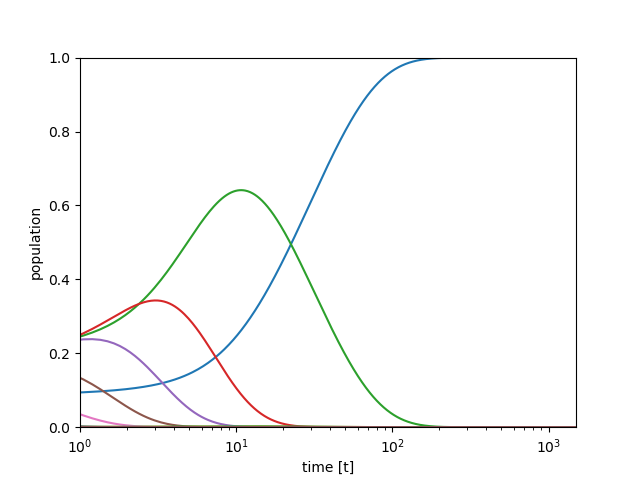
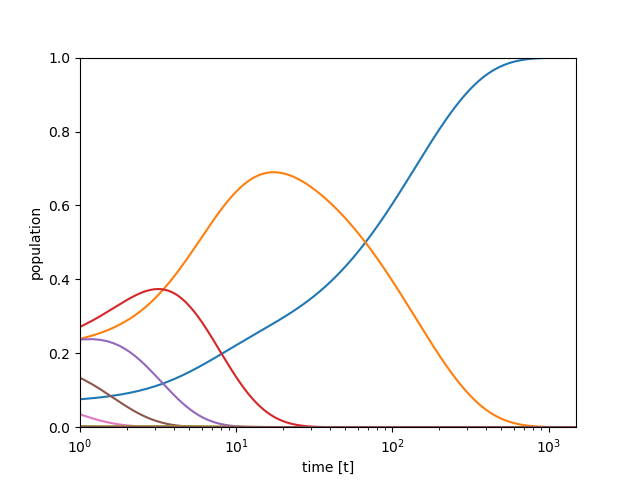

# molecular-cooling
simulation for molecular rotational cooling

## Requirements
* [NumPy](https://numpy.org/)
* [SciPy](https://www.scipy.org/) >=1.0.0 for using scipy.integrate.solve_ivp

## Installation
```
git clone https://github.com/harapekoaomushi/molecular-cooling.git
```

## Common Usage
1. `cd molecular-cooling`
1. Launch the python3 interpreter `python`.
1. Load the module of individual molecular data. `from molecular_data import CaH`
1. Load the module of the rotational cooling model. `from molecular_rotational_cooling import molecular_rotational_cooling
`
1. Generate an instance of CaH at 300 K. `mol = CaH(T_init = 300)`
1. Generate a simulation instance. `sim = molecular_rotational_cooling(mol)`
1. Run the simulation. `sim.run(sim.population_ode, GP=0, t_max=10000)`
1. Draw the result. `sim.draw()`
1. Save the figure. `sim.save_fig("./export/CaH_T300_PumpOFF.png", t_max=10000)`
1. Save the result as csv. `sim.save_csv("./export/CaH_T300_PumpOFF.csv")`

You can use `sim.draw_sum()` to check the sum of the populations for debug.

The wavelength (unit: μm) of the pumping laser (v=0 → v=2) can be obtained by running `10000/(mol.Ev[2]-mol.Ev[0])`


## Example
### CaH+, No optical pumping, Initial vibrational temperature: 300 K
#### Code
```
from molecular_data import CaH
from molecular_rotational_cooling import molecular_rotational_cooling

mol0 = CaH(T_init = 300)
sim_CaH0 = molecular_rotational_cooling(mol0)
sim_CaH0.run(sim_CaH0.population_ode, GP=0, t_max=10000)
#sim_CaH0.draw()
sim_CaH0.save_fig("./export/CaH_T300_PumpOFF.png", t_max=10000)
sim_CaH0.save_csv("./export/CaH_T300_PumpOFF.csv")
```

#### Result


---

### CaH+, pumping ON (v=0,J=1 -> v=2,J=0), Initial vibrational temperature: 300 K
wavelength of the pumping laser : 3.52 μm
#### Code
```
from molecular_data import CaH
from molecular_rotational_cooling import molecular_rotational_cooling

mol1 = CaH(T_init = 300)
sim_CaH1 = molecular_rotational_cooling(mol1)
sim_CaH1.run(sim_CaH1.population_ode, vJ_pump_i=[0,1], vJ_pump_f=[2,0], GP=10*(10**3), t_max=10000)
#sim_CaH1.draw()
sim_CaH1.save_fig("./export/CaH_T300_PumpON01_20.png", t_max=10000)
sim_CaH1.save_csv("./export/CaH_T300_PumpON01_20.csv")
```

#### Result


---

### HD+, No optical pumping, Initial vibrational temperature: 1000 K
#### Code
```
from molecular_data import HD
from molecular_rotational_cooling import molecular_rotational_cooling

mol2 = HD(T_init = 1000)
sim_HD0 = molecular_rotational_cooling(mol2)
sim_HD0.run(sim_HD0.population_ode, GP=0, t_max=1500)
#sim_HD0.draw_sum()
sim_HD0.save_fig("./export/HD_T1000_PumpOFF.png", t_max=1500)
sim_HD0.save_csv("./export/HD_T1000_PumpOFF.csv")
```

#### Result


---

### HD+, pumping ON (v=0,J=1 -> v=2,J=0), Initial vibrational temperature: 1000 K
wavelength of the pumping laser : 2.68 μm
#### Code
```
from molecular_data import HD
from molecular_rotational_cooling import molecular_rotational_cooling

mol3 = HD(T_init = 1000)
sim_HD1 = molecular_rotational_cooling(mol3)
sim_HD1.run(sim_HD1.population_ode, vJ_pump_i=[0,1], vJ_pump_f=[2,0], GP=10*(10**3), t_max=1500)
#sim_HD1.draw_sum()
sim_HD1.save_fig("./export/HD_T1000_PumpON01to20.png", t_max=1500)
sim_HD1.save_csv("./export/HD_T1000_PumpON01to20.csv")
```

#### Result


---

### HD+, pumping ON (v=0,J=2 -> v=2,J=1), Initial vibrational temperature: 1000 K
wavelength of the pumping laser : 2.68 μm
#### Code
```
from molecular_data import HD
from molecular_rotational_cooling import molecular_rotational_cooling

mol4 = HD(T_init = 1000)
sim_HD2 = molecular_rotational_cooling(mol4)
sim_HD2.run(sim_HD2.population_ode, vJ_pump_i=[0,2], vJ_pump_f=[2,1], GP=10*(10**3), t_max=1500)
#sim_HD2.draw_sum()
sim_HD2.save_fig("./export/HD_T1000_PumpON02to21.png", t_max=1500)
sim_HD2.save_csv("./export/HD_T1000_PumpON02to21.csv")
```

#### Result



---

### SH+, No optical pumping, Initial vibrational temperature: 300 K
#### Code
```
from molecular_data import SH
from molecular_rotational_cooling import molecular_rotational_cooling

mol6 = SH(T_init = 300)
sim_SH0 = molecular_rotational_cooling(mol6)
sim_SH0.run(sim_SH0.population_ode, GP=0, t_max=10000)
#sim_SH0.draw_sum()
sim_SH0.save_fig("./export/SH_T300_PumpOFF.png", t_max=10000)
sim_SH0.save_csv("./export/SH_T300_PumpOFF.csv")
```

#### Result


---

### SH+, pumping ON (v=0,J=1 -> v=2,J=0), Initial vibrational temperature: 300 K
wavelength of the pumping laser : 2.09 μm
#### Code
```
from molecular_data import SH
from molecular_rotational_cooling import molecular_rotational_cooling

mol7 = SH(T_init = 300)
sim_SH1 = molecular_rotational_cooling(mol7)
sim_SH1.run(sim_SH1.population_ode, vJ_pump_i=[0,1], vJ_pump_f=[2,0], GP=10*(10**3), t_max=10000)
#sim_SH1.draw_sum()
sim_SH1.save_fig("./export/SH_T300_PumpON01to20.png", t_max=10000)
sim_SH1.save_csv("./export/SH_T300_PumpON01to20.csv")
```

#### Result


---

### SH+, pumping ON (v=0,J=2 -> v=2,J=1), Initial vibrational temperature: 300 K
wavelength of the pumping laser : 2.09 μm
#### Code
```
from molecular_data import SH
from molecular_rotational_cooling import molecular_rotational_cooling

mol8 = SH(T_init = 300)
sim_SH2 = molecular_rotational_cooling(mol8)
sim_SH2.run(sim_SH2.population_ode, vJ_pump_i=[0,2], vJ_pump_f=[2,1], GP=10*(10**3), t_max=10000)
#sim_SH2.draw_sum()
sim_SH2.save_fig("./export/SH_T300_PumpON02to21.png", t_max=10000)
sim_SH2.save_csv("./export/SH_T300_PumpON02to21.csv")
```

---

### CH+, No optical pumping, Initial vibrational temperature: 1000 K
#### Code
```
from molecular_data import CH
from molecular_rotational_cooling import molecular_rotational_cooling

mol9 = CH(T_init = 1000)
sim_CH0 = molecular_rotational_cooling(mol9)
sim_CH0.run(sim_CH0.population_ode, GP=0, t_max=10000)
#sim_CH0.draw_sum()
sim_CH0.save_fig("./export/CH_T1000_PumpOFF.png", t_max=10000)
sim_CH0.save_csv("./export/CH_T1000_PumpOFF.csv")
```

#### Result


---

### CH+, pumping ON (v=0,J=1 -> v=2,J=0), Initial vibrational temperature: 1000 K
wavelength of the pumping laser : 1.86 μm
#### Code
```
from molecular_data import CH
from molecular_rotational_cooling import molecular_rotational_cooling

mol10 = CH(T_init = 1000)
sim_CH1 = molecular_rotational_cooling(mol10)
sim_CH1.run(sim_CH1.population_ode, vJ_pump_i=[0,1], vJ_pump_f=[2,0], GP=10*(10**3), t_max=10000)
#sim_CH1.draw_sum()
sim_CH1.save_fig("./export/CH_T1000_PumpON01to20.png", t_max=10000)
sim_CH1.save_csv("./export/CH_T1000_PumpON01to20.csv")
```

#### Result


---

### CH+, pumping ON (v=0,J=2 -> v=2,J=1), Initial vibrational temperature: 300 K
wavelength of the pumping laser : 1.86 μm
#### Code
```
from molecular_data import CH
from molecular_rotational_cooling import molecular_rotational_cooling

mol11 = CH(T_init = 1000)
sim_CH2 = molecular_rotational_cooling(mol11)
sim_CH2.run(sim_CH2.population_ode, vJ_pump_i=[0,2], vJ_pump_f=[2,1], GP=10*(10**3), t_max=10000)
#sim_CH2.draw_sum()
sim_CH2.save_fig("./export/CH_T1000_PumpON02to21.png", t_max=10000)
sim_CH2.save_csv("./export/CH_T1000_PumpON02to21.csv")
```

#### Result


---

## API Reference
```
molecular_data.CaH(T_init = 300., T_BBR = 4.)
```
### Parameters
* `T_init` : *float, optional*

Initial rotational temperature in Kelvin. Default is 300.

* `T_BBR` : *float, optional*

Temperature of a blackbody radiator in Kelvin. Default is 4.

### Class member
* `AJ` : *ndarray*

Einstein A coefficients for rotational transitions in ground electronic state. `AJ[v,J]` indicates the A coefficients from `J` to `J-1` when the vibrational level is `v`. Unit: s<sup>-1</sup>

* `gJ` : *ndarray*

Rotational transition rate by blackbody radiation in ground electronic state. `gJ[v,J]` insicates the translation rate from `J` to `J-1` or the rate from `J-1` to `J` when the vibrational level is `v`. Unit: s<sup>-1</sup>

* `Av` : *ndarray*

Einstein A-coefficient of vibrational Transitions in ground electronic state. `Av[v_init, v_fin]` indicates the A coefficients from `v_init` to `v_fin`. Unit: s<sup>-1</sup>

* `Boltzmann_plot` : *ndarray*

Rotatinal Boltzmann plot at `T_init` Kelvin. `Boltzmann_plot[J]` indicates the population of rotational level : `J` when the vibrational level is 0.

cf. If you want to get a Boltzmann plot of CaH at 4 Kelvin, do the following.
```
from molecular_data import CaH
mol_4K = CaH(T_init = 4)
print(mol_4K.Boltzmann_plot)
```
Result:
```
[9.07922709e-001 9.19029020e-002 1.74379793e-004 9.37781084e-009
 1.56272408e-014 8.35272028e-022 1.45657602e-030 8.36748037e-041
 1.59303419e-052 1.00916366e-065 2.13313436e-080 1.50756748e-096
 3.56777971e-114 2.83067479e-133 7.53618401e-154 6.73754321e-176
 2.02394765e-199 2.04389197e-224 6.94153096e-251]
```

## Equations
### Einstein A coefficients for rotational transitions *A*<sub>*J+1,J*</sub> `AJ`


[TeX]
```
A_{J+1,J} = \frac{16 \pi^3}{3\epsilon_0 h c^3}\frac{\mu_v^2}{3}\{2(J+1)B_v\}^3
```

where

*μ*<sub>*v*</sub> : permanent dipole moment of *v*-level and

*B*<sub>*v*</sub> : rotational constants of *v*-level.

### Rotational transition rate by blackbody radiation *γ*<sub>*J+1,J*</sub> `gJ`


[TeX]
```
\gamma_{J+1,J} = \frac{3A_{J+1,J}}{\exp[2(J+1)hB_v/k_BT]-1}
```

where

*μ*<sub>*v*</sub> : permanent dipole moment of *v*-level,

*B*<sub>*v*</sub> : rotational constants of *v*-level and

*A*<sub>*J+1,J*</sub> : Einstein A coefficients for rotational transitions from *J*+1 to *J*.

### Rate equation


[TeX]
```
\frac{dn_J}{dt} = -(\gamma_{J+1,J}+\gamma_{J,J-1}+A_{J,J-1})n_J + (\gamma_{J+1,J}+A_{J+1,J})n_{J+1} + \gamma_{J,J-1}n_{J-1}
```

where

*A*<sub>*J+1,J*</sub> : Einstein A coefficients for rotational transitions from *J*+1 to *J*,

*γ*<sub>*J+1,J*</sub> : rotational transition rate by blackbody radiation from *J*+1 to *J* and

*n*<sub>*J*</sub> : population of *J*-level.

## License
MIT License
