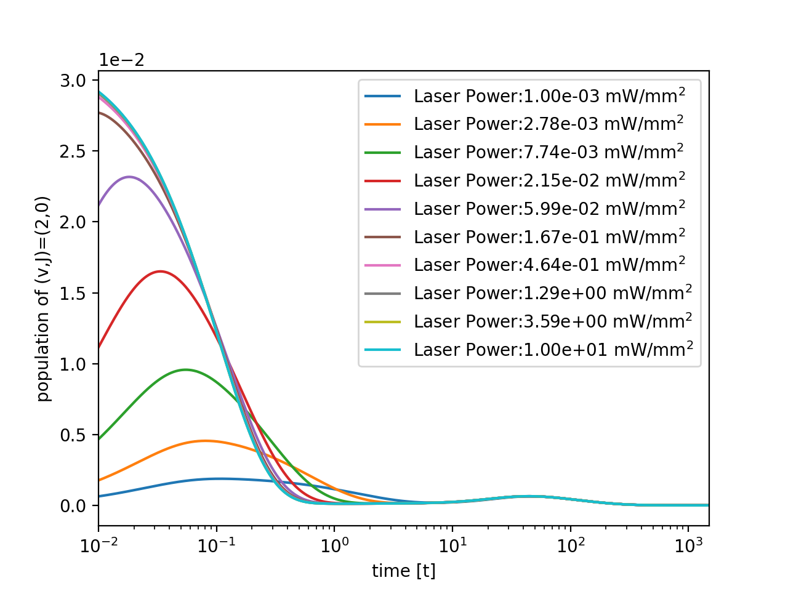

# molecular-cooling example of plots dependent on laser power
Example of simulation for molecular rotational cooling dependent on laser power

## CaH+, pumping ON (v=0,J=1 -> v=2,J=0), Initial vibrational temperature: 300 K
wavelength of the pumping laser : 3.52 μm
### time vs population of (v,J)=(2,0) for each laser power
#### Code
```
from molecular_data import CaH
from molecular_rotational_cooling import molecular_rotational_cooling
mol1 = CaH(T_init = 300)
sim_CaH1 = molecular_rotational_cooling(mol1)
sim_CaH1.draw_v_J_eachlaserPower(2,0)
```

#### Result


---

### laser power vs peak time of (v,J)=(2,0)
#### Code
```
from molecular_data import CaH
from molecular_rotational_cooling import molecular_rotational_cooling
mol1 = CaH(T_init = 300)
sim_CaH1 = molecular_rotational_cooling(mol1)
sim_CaH1.draw_laserPower_vs_v_J_peakTime(2,0)
```

#### Result


---

### laser power vs peak population of (v,J)=(2,0)
#### Code
```
from molecular_data import CaH
from molecular_rotational_cooling import molecular_rotational_cooling
mol1 = CaH(T_init = 300)
sim_CaH1 = molecular_rotational_cooling(mol1)
sim_CaH1.draw_laserPower_vs_v_J_peakHeight(2,0)
```

#### Result


---

### laser power vs the population of (v,J)=(2,0) in 1 seconds
#### Code
```
from molecular_data import CaH
from molecular_rotational_cooling import molecular_rotational_cooling
mol1 = CaH(T_init = 300)
sim_CaH1 = molecular_rotational_cooling(mol1)
sim_CaH1.draw_laserPower_vs_v_J_1secHeight(2,0)
```

#### Result


---

## HD+, pumping ON (v=0,J=1 -> v=2,J=0), Initial vibrational temperature: 1000 K
wavelength of the pumping laser : 2.68 μm
### time vs population of (v,J)=(2,0) for each laser power
#### Code
```
from molecular_data import HD
from molecular_rotational_cooling import molecular_rotational_cooling
mol3 = HD(T_init = 300)
sim_HD1 = molecular_rotational_cooling(mol3)
sim_HD1.draw_v_J_eachlaserPower(2,0)
```

#### Result


---

### laser power vs peak time of (v,J)=(2,0)
#### Code
```
from molecular_data import HD
from molecular_rotational_cooling import molecular_rotational_cooling
mol3 = HD(T_init = 300)
sim_HD1 = molecular_rotational_cooling(mol3)
sim_HD1.draw_laserPower_vs_v_J_peakTime(2,0)
```

#### Result


---

### laser power vs peak population of (v,J)=(2,0)
#### Code
```
from molecular_data import HD
from molecular_rotational_cooling import molecular_rotational_cooling
mol3 = HD(T_init = 300)
sim_HD1 = molecular_rotational_cooling(mol3)
sim_HD1.draw_laserPower_vs_v_J_peakHeight(2,0)
```

#### Result


---

### laser power vs the population of (v,J)=(2,0) in 1 seconds
#### Code
```
from molecular_data import HD
from molecular_rotational_cooling import molecular_rotational_cooling
mol3 = HD(T_init = 300)
sim_HD1 = molecular_rotational_cooling(mol3)
sim_HD1.draw_laserPower_vs_v_J_1secHeight(2,0)
```

#### Result


---

